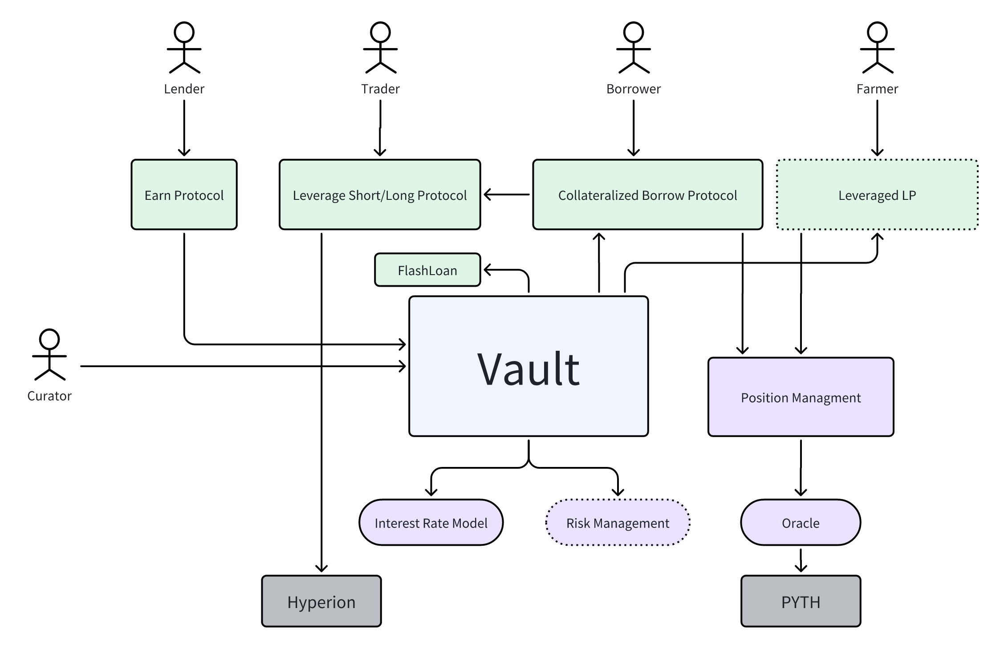

# Yeap Finance

Yeap Finance is a decentralized finance (DeFi) platform built on the Aptos blockchain.
It is a collection of smart contracts that enable users to create and manage financial instruments such as loans,
savings accounts.
Yeap Finance is designed to be secure, transparent, and efficient, with low transaction fees and fast settlement times.

## Lend and Borrow

lenders can deposits their fund into different vaults, each vaults can be customized with a borrow interest rate model,
and a vault can have multiple different kind of borrow managers who can borrow from the vault following the rules
defined by each borrow managers.

one of the borrow managers called position manager allows borrowers to create positions, add a collateral supported by
the borrow manager, then borrow the fund from the vault through the borrow manager of the vault.

another borrow manager so called flashloan, allows borrowers to borrow and repay funds from the vault instantly without
collaterals within one transaction.

Developers can build different borrow products based on Yeap Protocol.




## Development

``` shell
aptos move compile --package-dir yeap-vault
```

### License

Yeap Finance is licensed under the Business Source License 1.1 (BUSL-1.1), see [BUSL_LICENSE](./licenses/BUSL_LICENSE),
and the MIT License (MIT), see [MIT_LICENSE](./licenses/MIT_LICENSE).
Each file in Yeap Finance Core states the applicable license type in the header.